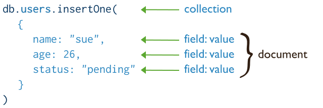

# Express and Mongodb - Client

The mongo shell is an interactive JavaScript interface to MongoDB. You can use the mongo shell to query and update data as well as perform administrative operations.

### Start the `mongo` shell

**NOTE: Ensure that MongoDB is running before attempting to start the mongo shell.**

```
mongo
```

---

### Select database

* To show the list of databases:

```
show dbs
```

* To display the database you are using:

```
db
```

* To switch database:

```
use <database>
```

---

### CURD

CRUD is an acronym for Create, Read, Update and Delete, which are 4 types of operations in MongoDB.

* Create - add new documents to a collection
* Read - retrieve documents from a collection
* Update - modify existing documents in a collection
* Remove - remove documents from a collection

---

### Create Operations

Create or insert operations add new documents to a collection. If the collection does not currently exist, insert operations will create the collection.

MongoDB provides the following methods to insert documents into a collection:

* db.collection.insertOne()
* db.collection.insertMany()

For example:



---

### Read Operation

Read operations retrieves documents from a collection; i.e. queries a collection for documents. MongoDB provides the following methods to read documents from a collection:

* db.collection.find()

You can specify query filters or criteria that identify the documents to return. For exmaple,

* `db.users.find()` will give you all documents in the `users` collection.
* `db.users.find({status: "pending"})` will only give you the documents with `status="pending"`


---

### Update Operation

Update operations modify existing documents in a collection. MongoDB provides the following methods to update documents of a collection:

* db.collection.updateOne()
* db.collection.updateMany()
* db.collection.replaceOne()

```js
db.users.updateOne({age: 26}, {$set: {status: 'reject'}});
```


---

### Delete Operation

Delete operations remove documents from a collection. MongoDB provides the following methods to delete documents of a collection:

* db.collection.deleteOne()
* db.collection.deleteMany()

```js
db.users.deleteOne({age: 26}});
```


