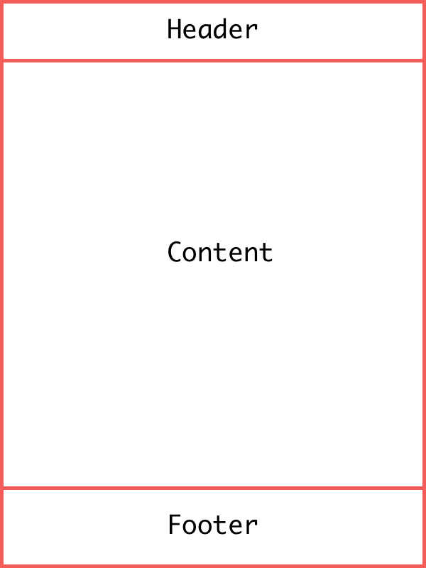
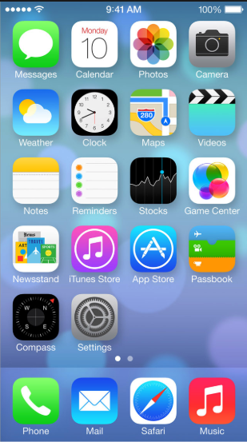
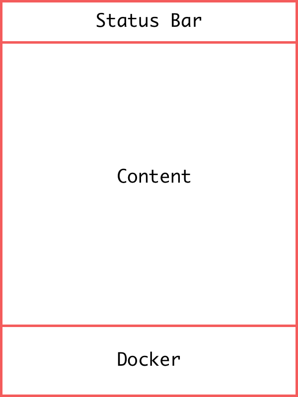
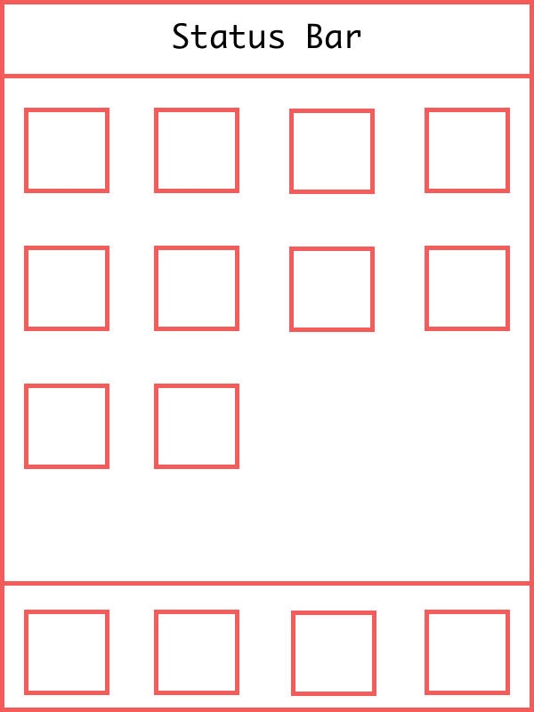

# Homework One

Reading Material: https://css-tricks.com/snippets/css/a-guide-to-flexbox

### Write React components for HTML table

A basic HTML table looks like this:

```html
<table>
  <tr>
    <td>&nbsp;</td>
    <td>Knocky</td>
    <td>Flor</td>
    <td>Ella</td>
    <td>Juan</td>
  </tr>
  <tr>
    <td>Breed</td>
    <td>Jack Russell</td>
    <td>Poodle</td>
    <td>Streetdog</td>
    <td>Cocker Spaniel</td>
  </tr>
  <tr>
    <td>Age</td>
    <td>16</td>
    <td>9</td>
    <td>10</td>
    <td>5</td>
  </tr>
  <tr>
    <td>Owner</td>
    <td>Mother-in-law</td>
    <td>Me</td>
    <td>Me</td>
    <td>Sister-in-law</td>
  </tr>
  <tr>
    <td>Eating Habits</td>
    <td>Eats everyone's leftovers</td>
    <td>Nibbles at food</td>
    <td>Hearty eater</td>
    <td>Will eat till he explodes</td>
  </tr>
</table>
```


Requirements:

* Write a React component for `<td>`, which is a single data in the table.
* Write a React component for `<tr>`, which is a row in the table that contains the `<td>` component.
* Write a React component for `<table>`, which contains a number of `<tr>` component.

---

### Build simple website layout

A simple website layout contains a header, a content container, and a footer like this:



Requirements:

* You need to write an individual component for header, content and footer.
* header should always stay in the top of the page.
* Footer should always stay in the bottom of the page.

---

### Build simple iPhone screen layout







Requirements:

* Write componets to build a simple iPhone screen layout
* Status bar should always stay in top
* Docker should always stay in bottom
* No need to have the extra icon and text for Apps, just use bordered squares.
* For each row the max number of icons is four
