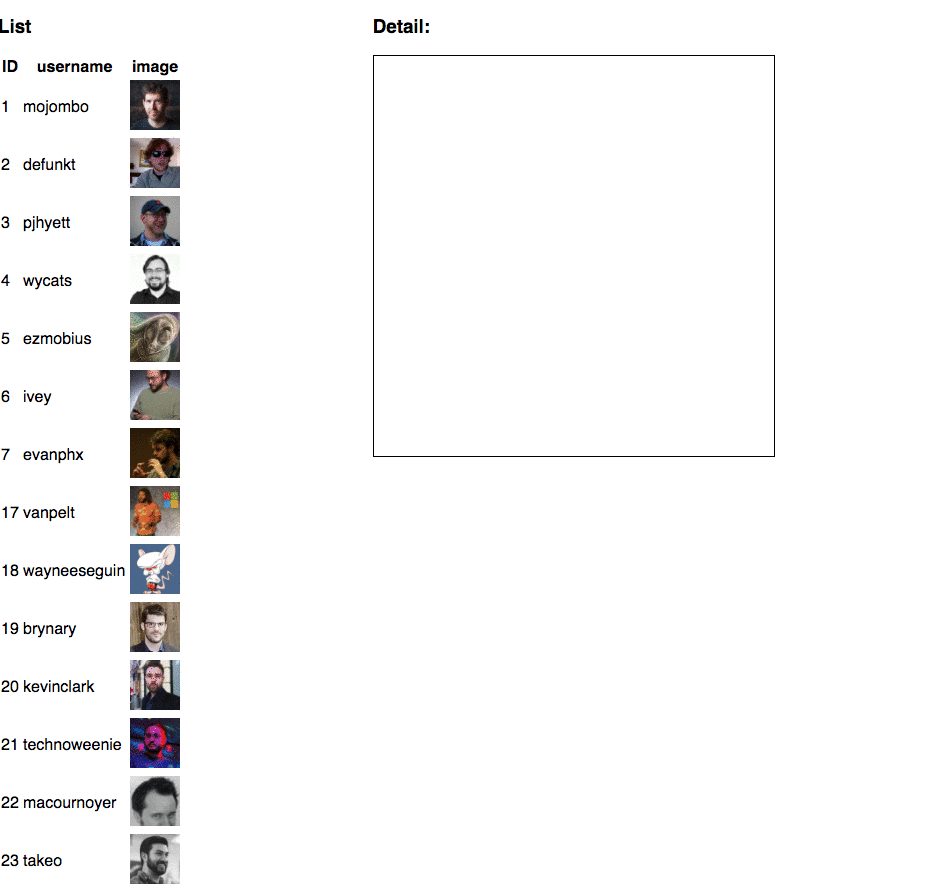

# Homework Four

In this homework, we are going to practice sending HTTP request in React and build a web application to view github users. First of all we will send a GET HTTP request to get 100 users from github, and render those data in the UI. Then every time when we click one of the user in the list, we will show the detail user information in the UI.



* Use the endpoint (https://api.github.com/users?per_page=100) to get 100 users from github, then make a list of user UIs in your web application showing user id, username (should be in key: login in the HTTP response) and user avatar images.
* You also need to have a place in your UI to show user details once you click one of the user in the user list. Suppose that one of the user data you get from is like:

```js
{
"login": "mojombo",
"id": 1,
"avatar_url": "https://avatars0.githubusercontent.com/u/1?v=4",
"gravatar_id": "",
"url": "https://api.github.com/users/mojombo",
"html_url": "https://github.com/mojombo",
"followers_url": "https://api.github.com/users/mojombo/followers",
"following_url": "https://api.github.com/users/mojombo/following{/other_user}",
"gists_url": "https://api.github.com/users/mojombo/gists{/gist_id}",
"starred_url": "https://api.github.com/users/mojombo/starred{/owner}{/repo}",
"subscriptions_url": "https://api.github.com/users/mojombo/subscriptions",
"organizations_url": "https://api.github.com/users/mojombo/orgs",
"repos_url": "https://api.github.com/users/mojombo/repos",
"events_url": "https://api.github.com/users/mojombo/events{/privacy}",
"received_events_url": "https://api.github.com/users/mojombo/received_events",
"type": "User",
"site_admin": false
}
```

You can get the user detail data by using the value in the "login" key: https://api.github.com/users/mojombo:

```js
{
"login": "mojombo",
"id": 1,
"avatar_url": "https://avatars0.githubusercontent.com/u/1?v=4",
"gravatar_id": "",
"url": "https://api.github.com/users/mojombo",
"html_url": "https://github.com/mojombo",
"followers_url": "https://api.github.com/users/mojombo/followers",
"following_url": "https://api.github.com/users/mojombo/following{/other_user}",
"gists_url": "https://api.github.com/users/mojombo/gists{/gist_id}",
"starred_url": "https://api.github.com/users/mojombo/starred{/owner}{/repo}",
"subscriptions_url": "https://api.github.com/users/mojombo/subscriptions",
"organizations_url": "https://api.github.com/users/mojombo/orgs",
"repos_url": "https://api.github.com/users/mojombo/repos",
"events_url": "https://api.github.com/users/mojombo/events{/privacy}",
"received_events_url": "https://api.github.com/users/mojombo/received_events",
"type": "User",
"site_admin": false,
"name": "Tom Preston-Werner",
"company": null,
"blog": "http://tom.preston-werner.com",
"location": "San Francisco",
"email": null,
"hireable": null,
"bio": null,
"public_repos": 59,
"public_gists": 62,
"followers": 20815,
"following": 11,
"created_at": "2007-10-20T05:24:19Z",
"updated_at": "2018-02-26T20:05:14Z"
}
```

Choose some fields to show as the user detail like "name", "location", "followers", etc.

* Once you click another user in the UI, the detail container will show that user's detail.
