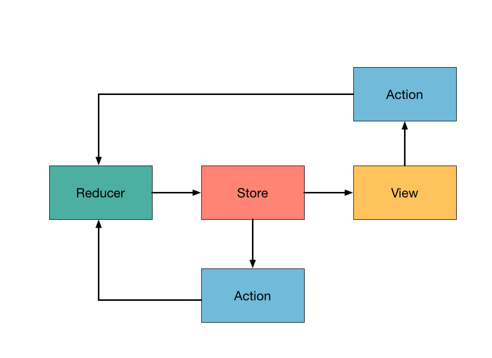

# What is Redux

Redux is a predictable state container for JavaScript apps.

Redux helps you write applications that behave consistently, run in different environments (client, server, and native), and are easy to test.

You can use Redux together with React, or with any other view library. It is tiny (2kB, including dependencies).

### When to use Redux

* Same piece of application state needs to be mapped to multiple container components.
  A good example of this is user state. When the app first loads, information about the user needs to be shared with various components in the navbar and each page. It’s likely these components don’t have any direct relationship so Redux provides a convenient way to share state.
* Too many props are being passed through multiple parent-and-child components.
* You want to separate state out of components for a better code structure

If the React project you’re working on doesn’t meet any of these criteria, then setState would likely do just fine. Redux really just becomes a tool to use in the right situation.

It is recommended to consider using Redux right from the start. Another opinion says to only start using Redux when you absolutely need it. However, in most of the cases, state management can get ugly and hard to maintain very quickly.

---

### Flux Architecture

---

### Three Principles

* Single source of truth
  The state of your whole application is stored in an object tree within a single store.

* State is read-only
  The only way to change the state is to emit an action, an object describing what happened.

* Changes are made with pure functions
  To specify how the state tree is transformed by actions, you write pure reducers.
